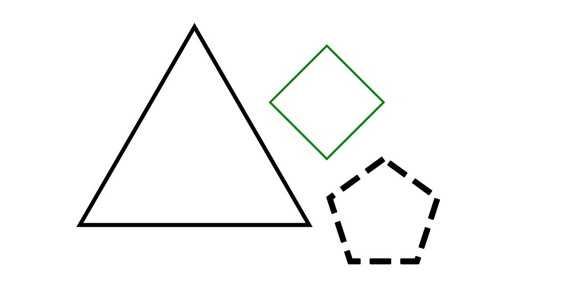
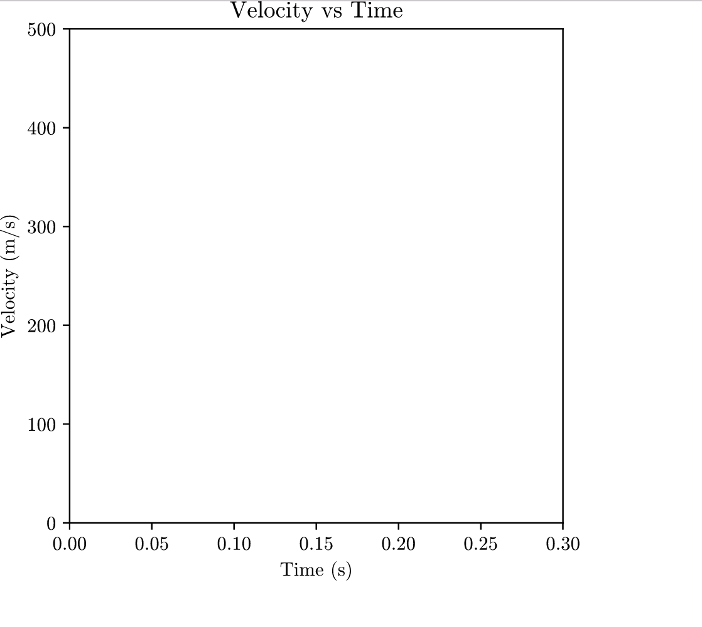

# Easy Figures

### Purpose
The purpose of this library is to reduce the complexity of adding simple shapes
and creating function graphs using matplotlib.

### Structure
Shapes and functions are added to the `Figures` class which controls anything exported.
Using the `Figures` class you can either save to file or display it on the screen using various renderers.
The `Figures` lets you add shapes and modify the axes.

### Examples

#### Circle

		f = figures.Figures([[-10,25],[-10,25]], bgcolor='w')
		circ = f.addCircle(xy=(7,10), label="r", radius=10, fc='#f4ab7a', lw=5)

		f.__writeFile__('/Users/<USER>/circle.png')

#### Ellipse

		f = figures.Figures([[-10,25],[-10,25]], bgcolor='w')
		ell = f.addEllipse(xy=[7,10], r=(9,12), angle=20.0)
		ell.ellipseLabels(xlabel='x', ylabel='y', isRadius=False)

		f.__writeFile__('/Users/<USER>/ellipse.png')

#### Axis

		f = figures.Figures([[-10,10],[-5,5]], bgcolor='w')
		f.format_axis(xyrange=[[-10,10], [-10,10]], grid=True, tick_interval=.25, tick_label_interval=1, color='blue')

		f.__writeFile__('/Users/<USER>/axis.png')

#### Functions

		f = figures.Figures()

		func = lambda x: np.sin(x)
		func2 = lambda x: x**2

		f.addFunction(
			func,
			[[-3*np.pi,3*np.pi],[-3*np.pi,3*np.pi]],
			color="green",
			lw=2
		)

		f.addFunction(
			func2,
			[[-3*np.pi,3*np.pi],[-3*np.pi,3*np.pi]],
			color="orange",
			lw=2
		)

		 f.__writeFile__('/Users/<USER>/func.png')

#### Triangle

		f = figures.Figures([[-7,7],[-12,12]], bgcolor='w')

		t = f.addTriangle(isSide=False, angle=np.pi/6, xy=[-3,6], rotation=0/np.pi, length=4)
		t.labelAngles([r'\alpha', r'\beta', r'\gamma'])
		t.labelOppositeSides(['A', 'B', 'C'])
		t.labelVertices(['a', 'b', 'c'])

		f.__writeFile__('/Users/<USER>/triangle.png')

#### Regular Polygon

		f = figures.Figures([[-15,15],[-15,15]], bgcolor='w')
		f.addRegularPolygon((-4,-3), 3, radius=7, mplprops={'ec':'k', 'color':'orange'})
		f.addRegularPolygon((3,0), 4, radius=3, orientation=np.pi/2, lw=1, mplprops={'color':'green'})
		f.addRegularPolygon((6,-6), 5, radius=3, lw=3, mplprops={'ls':'dashed'})

		f.__writeFile__('/Users/<USER>/regpoly.png')

    

#### Polygon

		f = figures.Figures([[0,20],[-5, 15]], bgcolor='w')
		poly = f.addPolygon(
			[
				[8.5, 2.5],
				[1.5, 6.1],
				[7.2, 12.3],
				[12.0, 12.3],
				[15.4, 6.1]
			],
			lw=3
		)
		poly.labelVertices(['a', 'b', 'c', 'd', 'e'])
		poly.labelAngles([r'\alpha', r'\beta', r'\gamma', r'\delta', r'\epsilon'])

		f.__writeFile__('/Users/<USER>/polygon.png')

#### Point

		f = figures.Figures([[-7,7],[-7,7]], bgcolor='w')
		f.addPoint((2,3), texts='A', color='k', pointsize=4)
		f.addPoint([(2,-2), (4,-4), (6,-6)], texts=['C','D','E'], color=['red', 'blue', 'green'], pointsize=7)

		f.__writeFile__('/Users/<USER>/point.png')

#### Text

		f = figures.Figures([[-7,7],[-5,5]], bgcolor='w')
		f.addText((-4,-2), "With\ cool\ effects", bbox=dict(boxstyle="rarrow,pad=0.3", ec="b", lw=2), color='blue')
		f.addText((2,4), r"Rendered\ as\  TeX\ ->\ \int_{a}^{b} x^2 dx")
		f.addText((0,1), "Or plain text!", latex=False, color='green', fontsize=18)

		f.__writeFile__('/Users/<USER>/text.png')

#### Arrow

		f = figures.Figures([[-15,15],[-10,10]], bgcolor='w')
		f.addArrow((-8,-7), (-4, 3), lw=1, arrowstyle='|-|', connectionstyle='bar')
		f.addArrow((8,-8), (-8, 10), arrowstyle='<->', connectionstyle='bar')
		f.addArrow((-8,-8), (8, -9), lw=1, arrowstyle='<|-|>', connectionstyle='arc', mplprops={'ls':'dotted'})
		f.addArrow((10,8), (4, 4), arrowstyle='fancy', connectionstyle='bar')
		f.addArrow((8,8), (3, 4), lw=1, arrowstyle='fancy', connectionstyle='bar', mplprops={'color':'white', 'ec':'black'})

		f.__writeFile__('/Users/<USER>/arrow.png')

#### Wedge

		f = figures.Figures([[-15,15],[-15,15]], height=200, width=200, bgcolor='w')
		for x in range(0,8):
			 f.addWedge((0,0), r=10, theta1=32*x, theta2=(32*x)+32, mplprops={'color':'#a39c92', 'ec':'#f0feffff', 'lw':1})
		f.addWedge((0.2,-0.8), r=10, theta1=259, theta2=291, mplprops={'color':'orange', 'ec':'w', 'lw':1})
		f.addWedge((0,0), r=10, theta1=296, theta2=328, mplprops={'color':'#a39c92', 'ec':'w', 'lw':1})
		f.addWedge((0,0), r=10, theta1=328, theta2=360, mplprops={'color':'#a39c92', 'ec':'w', 'lw':1})

		f.__writeFile__('/Users/<USER>/wedge.png')

#### Box

		f = figures.Figures([[-10,10],[-10,10]], height=400, width=400)
		f.addBox((0,0.3), (0,500), xlabel='Time (s)', ylabel='Velocity (m/s)', title='Velocity vs Time')

		f.__writeFile__('/Users/<USER>/box.png')

# License

* Licensed under the Apache License
* Please note: Any and all modifications to this code must also be licensed under Apache
