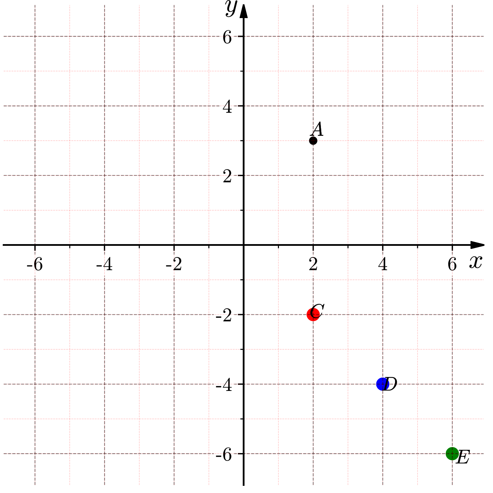
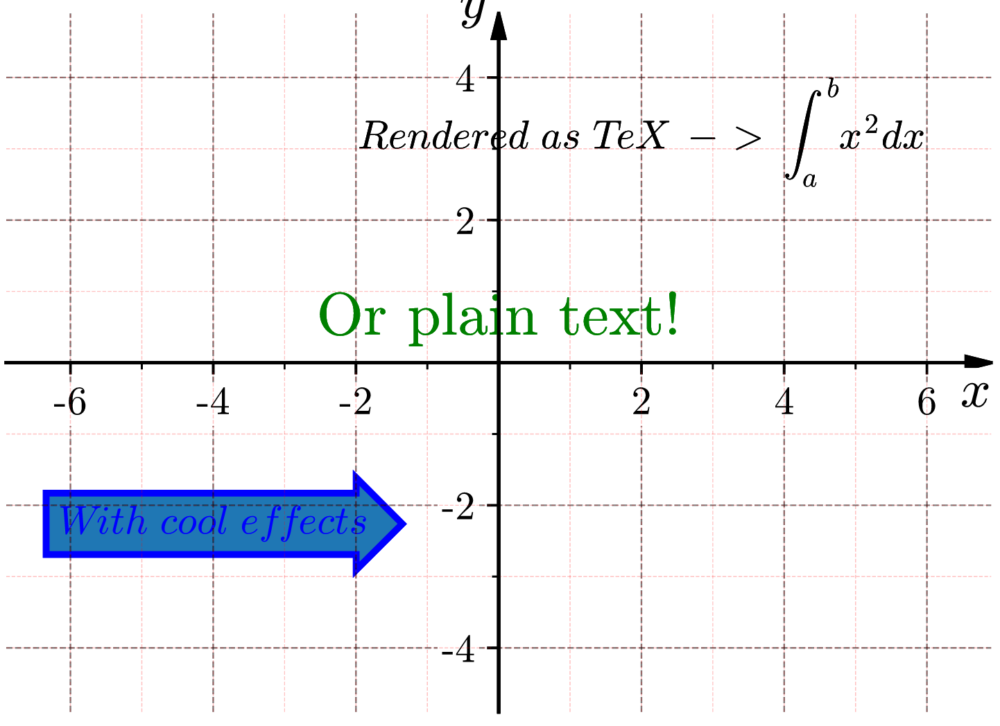
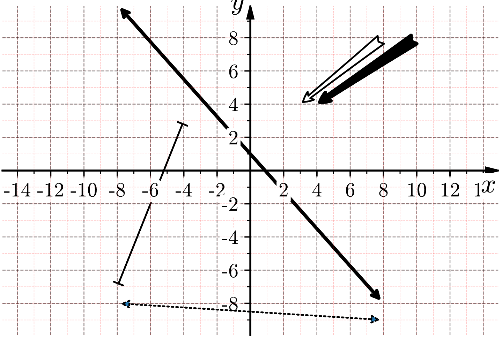
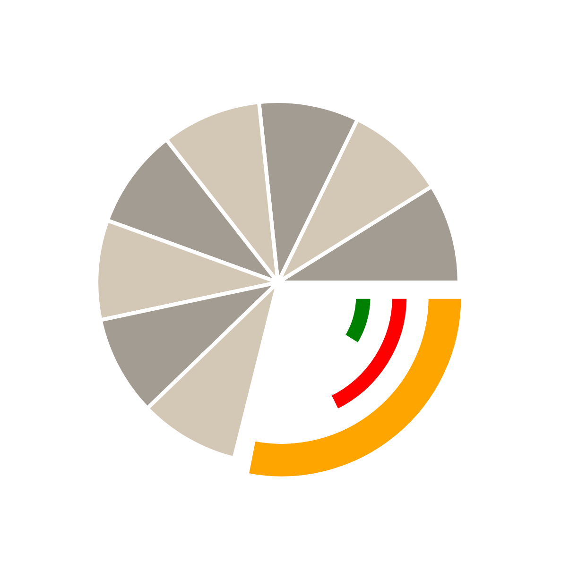

# Easy Figures

### Purpose
The purpose of this library is to reduce the complexity of adding simple shapes
and creating function graphs using matplotlib.

### Structure
Shapes and functions are added to the `Figures` class which controls anything exported.
Using the `Figures` class you can either save to file or display it on the screen using various renderers.
The `Figures` lets you add shapes and modify the axes.

### Examples

#### Circle

    f = figures.Figures([[-10,25],[-10,25]], bgcolor='w')
		circ = f.addCircle(xy=(7,10), label="r", radius=10, fc='#f4ab7a', lw=5)

	  f.__writeFile__('/Users/<USER>/circle.png')

#### Ellipse

    f = figures.Figures([[-10,25],[-10,25]], bgcolor='w')
    ell = f.addEllipse(xy=[7,10], r=(9,12), angle=20.0)
  	ell.ellipseLabels(xlabel='x', ylabel='y', isRadius=False)

    f.__writeFile__('/Users/<USER>/ellipse.png')

#### Axis

    f = figures.Figures([[-10,10],[-5,5]], bgcolor='w')
    f.format_axis(xyrange=[[-10,10], [-10,10]], grid=True, tick_interval=.25, tick_label_interval=1, color='blue')

    f.__writeFile__('/Users/<USER>/axis.png')

#### Functions

  	f = figures.Figures()

    func = lambda x: np.sin(x)
  	func2 = lambda x: x**2

		f.addFunction(
			func,
			[[-3*np.pi,3*np.pi],[-3*np.pi,3*np.pi]],
			color="green",
			lw=2
		)

		f.addFunction(
			func2,
			[[-3*np.pi,3*np.pi],[-3*np.pi,3*np.pi]],
			color="orange",
			lw=2
		)

	   f.__writeFile__('/Users/<USER>/func.png')

#### Triangle

    f = figures.Figures([[-7,7],[-12,12]], bgcolor='w')

    t = f.addTriangle(isSide=False, angle=np.pi/6, xy=[-3,6], rotation=0/np.pi, length=4)
    t.labelAngles([r'\alpha', r'\beta', r'\gamma'])
    t.labelOppositeSides(['A', 'B', 'C'])
    t.labelVertices(['a', 'b', 'c'])

    f.__writeFile__('/Users/<USER>/triangle.png')

#### Regular Polygon

#### Polygon

    f = figures.Figures([[0,20],[-5, 15]], bgcolor='w')
    poly = f.addPolygon(
			[
				[8.5, 2.5],
				[1.5, 6.1],
				[7.2, 12.3],
				[12.0, 12.3],
				[15.4, 6.1]
			],
			lw=3
		)
		poly.labelVertices(['a', 'b', 'c', 'd', 'e'])
		poly.labelAngles([r'\alpha', r'\beta', r'\gamma', r'\delta', r'\epsilon'])

	  f.__writeFile__('/Users/<USER>/polygon.png')

#### Point

    f = figures.Figures([[-7,7],[-7,7]], bgcolor='w')

    f.addPoint((2,3), texts='A', color='k', pointsize=4)
		f.addPoint([(2,-2), (4,-4), (6,-6)], texts=['C','D','E'], color=['red', 'blue', 'green'], pointsize=7)

    f.__writeFile__('/Users/<USER>/point.png')

#### Text

    f = figures.Figures([[-7,7],[-5,5]], bgcolor='w')

		f.addText((-4,-2), "With\ cool\ effects", bbox=dict(boxstyle="rarrow,pad=0.3", ec="b", lw=2), color='blue')
		f.addText((2,4), r"Rendered\ as\  TeX\ ->\ \int_{a}^{b} x^2 dx")
		f.addText((0,1), "Or plain text!", latex=False, color='green', fontsize=18)

    f.__writeFile__('/Users/<USER>/text.png')

#### Arrow

    f = figures.Figures([[-15,15],[-10,10]], bgcolor='w')

    f.addFancyArrow(posA=(-8,-7), posB=(-4, 3), lw=1, arrowstyle='|-|', connectionstyle='bar', mplprops={'mutation_scale':3})
    f.addFancyArrow(posA=(8,-8), posB=(-8, 10), arrowstyle='<->', connectionstyle='bar', mplprops={'mutation_scale':10})
    f.addFancyArrow(posA=(-8,-8), posB=(8, -9), lw=1, arrowstyle='<|-|>', connectionstyle='arc', mplprops={'mutation_scale':10, 'ls':'dotted'})
    f.addFancyArrow(posA=(10,8), posB=(4, 4), arrowstyle='fancy', connectionstyle='bar', mplprops={'mutation_scale':15, 'color':'black'})
    f.addFancyArrow(posA=(8,8), posB=(3, 4), lw=1, arrowstyle='fancy', connectionstyle='bar', mplprops={'mutation_scale':15, 'color':'white', 'ec':'black'})

    f.__writeFile__('/Users/<USER>/arrow.png')

#### Wedge

    f = figures.Figures([[-15,15],[-15,15]], height=200, width=200, bgcolor='w')

		f.addWedge((0,0), r=10, theta1=0, theta2=32, mplprops={'color':'#a39c92', 'lw':1})
		f.addWedge((0,0), r=10, theta1=32, theta2=64, mplprops={'color':'#d3c7b6', 'lw':1})
		f.addWedge((0,0), r=10, theta1=64, theta2=96, mplprops={'color':'#a39c92', 'lw':1})
 		f.addWedge((0,0), r=10, theta1=96, theta2=128, mplprops={'color':'#d3c7b6', 'lw':1})
 		f.addWedge((0,0), r=10, theta1=128, theta2=160, mplprops={'color':'#a39c92','lw':1})
		f.addWedge((0,0), r=10, theta1=160, theta2=192, mplprops={'color':'#d3c7b6', 'lw':1})
		f.addWedge((0,0), r=10, theta1=192, theta2=224, mplprops={'color':'#a39c92', 'lw':1})
		f.addWedge((0,0), r=10, theta1=224, theta2=256, mplprops={'color':'#d3c7b6', 'lw':1})
		f.addWedge((0.2,-0.8), r=10, theta1=259, theta2=360, width=2, mplprops={'color':'orange', 'lw':1})
		f.addWedge((0.2,-0.8), r=7, theta1=296, theta2=360, width=1, mplprops={'color':'red', 'lw':1})
		f.addWedge((0.2,-0.8), r=5, theta1=328, theta2=360, width=1, mplprops={'color':'green', 'lw':1})

    f.__writeFile__('/Users/<USER>/wedge.png')

# License

* Licensed under the Apache License
* Please note: Any and all modifications to this code must also be licensed under Apache
