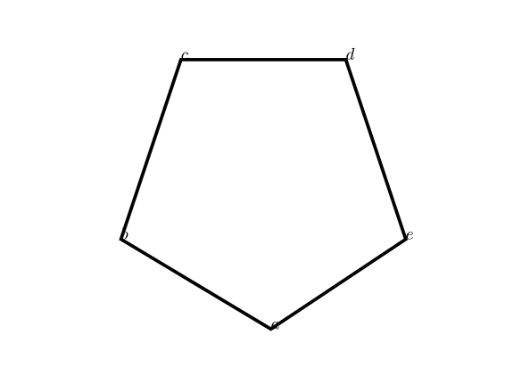
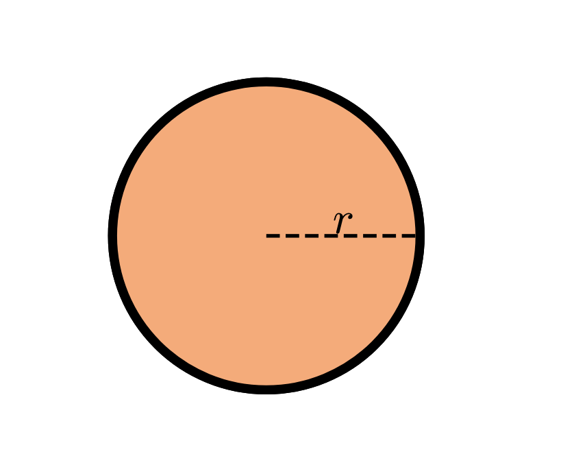
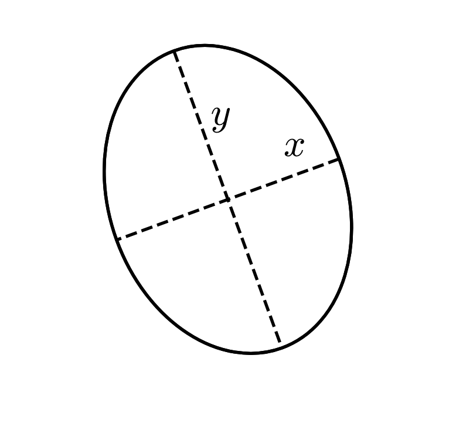
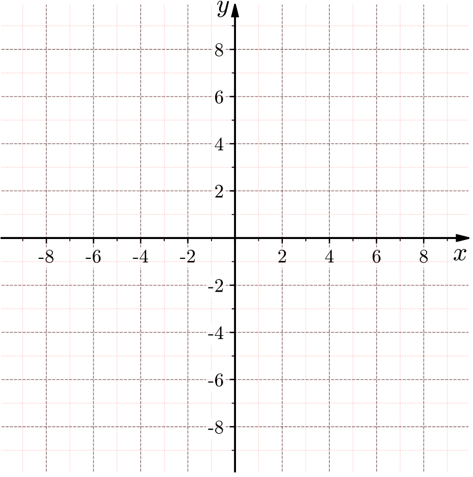
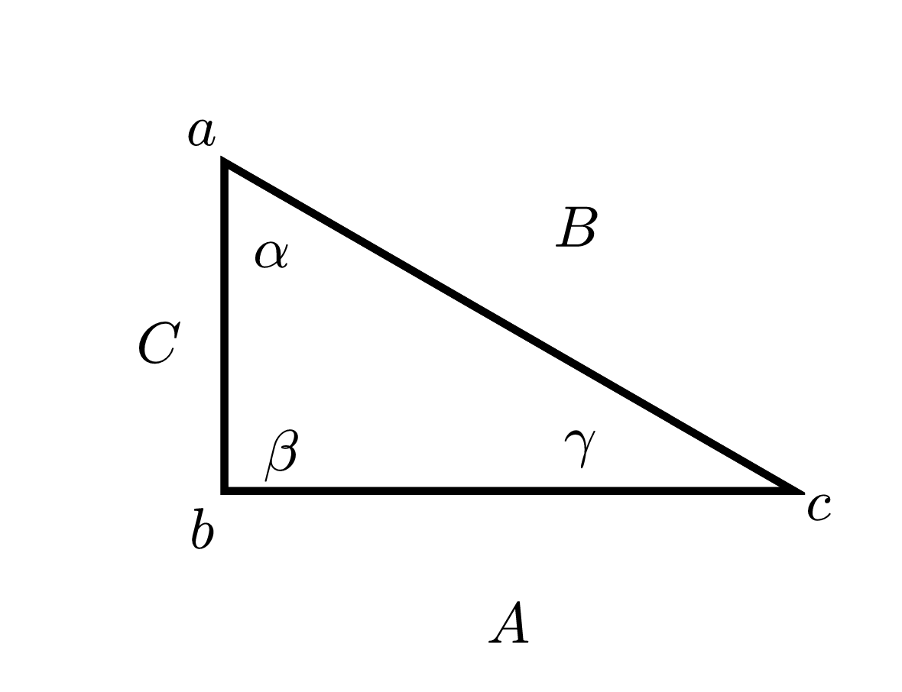

# README

### Purpose
The purpose of this library is to reduce the complexity of adding simple shapes
and creating function graphs using matplotlib.

### Structure
Shapes and functions are added to the `Figures` class which controls anything exported.
Using the `Figures` class you can either save to file or display it on the screen using various renderers.
The `Figures` lets you add shapes and modify the axes.

### Examples
##### Regular Polygon

    f = figures.Figures([[0,20],[-5, 15]], bgcolor='w')
    poly = f.addPolygon(
			[
				[8.5, 2.5],
				[1.5, 6.1],
				[7.2, 12.3],
				[12.0, 12.3],
				[15.4, 6.1]
			],
			lw=3
		)
		poly.labelVertices(['a', 'b', 'c', 'd', 'e'])
		poly.labelAngles([r'\alpha', r'\beta', r'\gamma', r'\delta', r'\epsilon'])

	f.__writeFile__('/Users/<USER>/polygon.png')

##### Circle

    f = figures.Figures([[-10,25],[-10,25]], bgcolor='w')
		circ = f.addCircle(xy=(7,10), label="r", radius=10, fc='#f4ab7a', lw=5)

	f.__writeFile__('/Users/<USER>/circle.png')

#### Ellipse

    f = figures.Figures([[-10,25],[-10,25]], bgcolor='w')
    ell = f.addEllipse(xy=[7,10], r=(9,12), angle=20.0)
  	ell.ellipseLabels(xlabel='x', ylabel='y', isRadius=False)

  f.__writeFile__('/Users/<USER>/ellipse.png')

##### Axis

    f = figures.Figures([[-10,10],[-5,5]], bgcolor='w')
    f.format_axis(xyrange=[[-10,10], [-10,10]], grid=True, tick_interval=.25, tick_label_interval=1, color='blue')

  f.__writeFile__('/Users/<USER>/axis.png')

##### Functions

  	f = figures.Figures()

      func = lambda x: np.sin(x)
  		func2 = lambda x: x**2

  		f.addFunction(
  			func,
  			[[-3*np.pi,3*np.pi],[-3*np.pi,3*np.pi]],
  			color="green",
  			lw=2
  		)

  		f.addFunction(
  			func2,
  			[[-3*np.pi,3*np.pi],[-3*np.pi,3*np.pi]],
  			color="orange",
  			lw=2
  		)

  	f.__writeFile__('/Users/<USER>/func.png')

##### Triangle

    f = figures.Figures([[-7,7],[-12,12]], bgcolor='w')

    t = f.addTriangle(isSide=False, angle=np.pi/6, xy=[-3,6], rotation=0/np.pi, length=4)
    t.labelAngles([r'\alpha', r'\beta', r'\gamma'])
    t.labelOppositeSides(['A', 'B', 'C'])
    t.labelVertices(['a', 'b', 'c'])

    f.__writeFile__('/Users/<USER>/triangle.png')

# License

* Licensed under the Apache License
* Please note: Any and all modifications to this code must also be licensed under Apache
